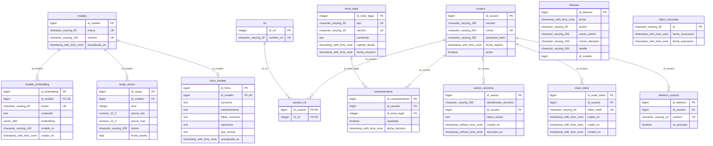

# Modelo de datos actual

> Generado con `scripts/generar-diagrama.sh` desde la base de datos real (última migración aplicada: V13). No se edita a mano: se regenera al agregar migraciones.

```mermaid
erDiagram
    modelo ||--o{ modelo_embedding : "id_modelo"
    modelo ||--o{ rango_precio : "id_modelo"
    modelo ||--o| ficha_modelo : "id_modelo"
    rol ||--o{ usuario_rol : "id_rol"
    texto_legal ||--o{ consentimiento : "id_texto_legal"
    usuario |o--o{ sesion_anonima : "id_usuario"
    usuario ||--o{ consentimiento : "id_usuario"
    usuario ||--o{ reset_token : "id_usuario"
    usuario ||--o{ telefono_usuario : "id_usuario"
    usuario ||--o{ usuario_rol : "id_usuario"
    bitacora {
        bigint id_bitacora PK
        timestamp_with_time_zone fecha
        character_varying_30 accion
        character_varying_255 correo_admin
        character_varying_255 correo_afectado
        character_varying_500 detalle
        bigint id_modelo
    }
    consentimiento {
        bigint id_consentimiento PK
        bigint id_usuario FK
        integer id_texto_legal FK
        boolean aceptado
        timestamp_with_time_zone fecha_decision
    }
    ficha_modelo {
        bigint id_ficha PK
        bigint id_modelo FK, UK
        text consumo
        text mantenimiento
        text fallas_comunes
        text repuestos
        text que_revisar
        timestamp_with_time_zone actualizado_en
    }
    modelo {
        bigint id_modelo PK
        character_varying_60 marca UK
        character_varying_100 nombre UK
        timestamp_with_time_zone actualizado_en
    }
    modelo_embedding {
        bigint id_embedding PK
        bigint id_modelo FK, UK
        character_varying_60 fuente UK
        text contenido
        vector_384 embedding
        character_varying_100 modelo_ia
        timestamp_with_time_zone creado_en
    }
    rango_precio {
        bigint id_rango PK
        bigint id_modelo FK
        integer anio
        numeric_12_2 precio_min
        numeric_12_2 precio_max
        character_varying_200 fuente
        date fecha_fuente
    }
    reset_token {
        bigint id_reset_token PK
        bigint id_usuario FK
        character_varying_64 token_hash UK
        timestamp_with_time_zone expira_en
        timestamp_with_time_zone usado_en
        timestamp_with_time_zone creado_en
    }
    rol {
        integer id_rol PK
        character_varying_30 nombre_rol UK
    }
    sesion_anonima {
        bigint id_sesion PK
        character_varying_255 identificador_anonimo
        bigint id_usuario FK
        text datos_sesion
        timestamp_without_time_zone creado_en
        timestamp_without_time_zone asociado_en
    }
    telefono_usuario {
        bigint id_telefono PK
        bigint id_usuario FK
        character_varying_16 numero UK
        boolean es_principal
    }
    texto_legal {
        integer id_texto_legal PK
        character_varying_50 tipo UK
        character_varying_20 version UK
        text contenido
        timestamp_with_time_zone vigente_desde
        timestamp_with_time_zone fecha_creacion
    }
    token_revocado {
        character_varying_36 jti PK
        timestamp_with_time_zone fecha_revocacion
        timestamp_with_time_zone fecha_expiracion
    }
    usuario {
        bigint id_usuario PK
        character_varying_100 nombre
        character_varying_254 correo UK
        character_varying_255 password_hash
        timestamp_with_time_zone fecha_registro
        boolean activo
    }
    usuario_rol {
        bigint id_usuario FK, PK
        integer id_rol FK, PK
    }
```
